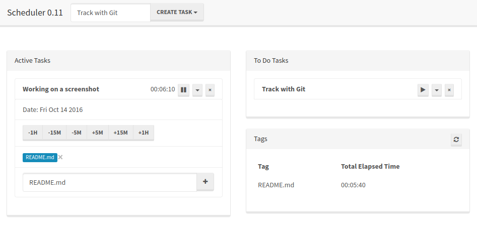

# Scheduler

A client-side web app that tracks time spent on specific tasks and organizes them with a tagging system. The app runs entirely in the user's browser; it has no server, and your private information is never transmitted over the internet. Task information is auto-saved to the browser's [localStorage](https://developer.mozilla.org/en-US/docs/Web/API/Storage/LocalStorage).

You can use it online, hosted on Github Pages [here](christopherfujino.github.io/scheduler).

Built with:

1. [AngularJS v1.4](https://angularjs.org)
2. [jQuery v2.1.3](http://jquery.com)
3. [Twitter Bootstrap v3.3.4](http://getbootstrap.com)
4. [Thomas Park](http://thomaspark.co/)'s [Lumen Bootstrap theme](http://bootswatch.com/lumen/)
5. [Font Awesome v4.3.0](http://fontawesome.io)
